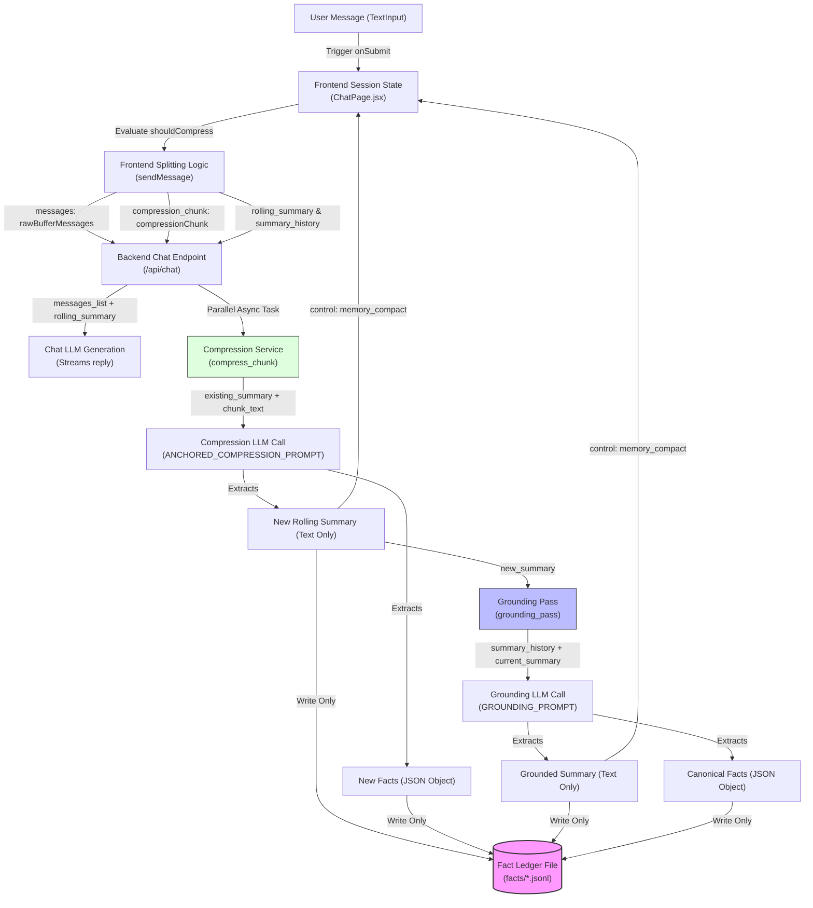

# Forensic Memory System Audit & Root-Cause Analysis

This report documents the forensic audit of the long-context memory system. It details the exact mechanism behind the observed semantic memory degradation (fact loss and disappearing information over epochs).

---

## 1. Memory Architecture Diagram

The diagram below illustrates the actual data flow, LLM boundaries, state transitions, and file-storage paths.



---

## 2. Full Data Flow Trace

| Stage | Input Data | Output Data | Mutation / Truncation / Filtering / State Replacement Operations |
| :--- | :--- | :--- | :--- |
| **1. User Message** | User input string | `userMessage` object with UUID | Instantiates a message dictionary with roles (`user`, `assistant`). |
| **2. Frontend Context State** | Current `displayMessages` & `contextMessages` arrays | `nextDisplayMessages` & `nextContextMessages` | Appends `userMessage` to active arrays. Appends empty `assistantMessage` container to UI state. |
| **3. Compression Trigger Logic** | `nextContextMessages` | `shouldCompress` (boolean) | Evaluated using `nextContextMessages.length >= TRIGGER_THRESHOLD` (synchronous). |
| **4. Compression Chunk Extraction** | `nextContextMessages` | `compressionChunk` and `rawBufferMessages` | **Truncation / Slicing:** If compressing, `compressionChunk` gets index `0` to `len - R` (removed from chat payload). `rawBufferMessages` gets last `R` messages (or last `T` if not compressing). |
| **5. Compression Request Payload** | `rawBufferMessages`, `compressionChunk`, `rolling_summary`, `summary_history`, metadata presets | JSON POST payload | Stripped to raw roles and content mappings. Live telemetry snapshot written to `localStorage`. |
| **6. Backend Chat Endpoint** | `ChatRequest` payload | SSE streams (`parsed.chunk` + `control_frame`) | **State Integration:** Prepend `rolling_summary` to chat context. **Token Budgeting:** Strips system prompt, runs `build_payload_within_budget` (asynchronously), drops oldest messages if over limit. |
| **7. Compression Service** | `compressionChunk`, `rolling_summary` (as `existing_summary`) | `new_summary` (text) | **Recursive Rewrite:** Formats chunk as string. Feeds it along with `existing_summary` into LLM via `ANCHORED_COMPRESSION_PROMPT`. |
| **8. Rolling Summary Update** | LLM text output (containing text + JSON) | Text summary (JSON stripped) | **Filtering:** Splits output by `FACTS_JSON:` marker. The JSON portion is parsed into `facts` dict. Only the text summary portion is returned. **Token Budgeting:** Runs `cap_summary_by_tokens` to defensively prune the text summary to under 800 tokens. |
| **9. Summary History Update** | N/A (Backend does not write `summary_history`) | N/A | Written to ledger file on disk (`facts/*.jsonl`) via async background thread pool. No updates sent back to client for `summary_history`. |
| **10. Grounding Pass** | `summary_history` array, `new_summary` | `grounded_summary` (text) | **Grounding Reconciliation:** Formats history plus current summary into `versions_text`. Feeds to `GROUNDING_PROMPT`. Parses output to strip `CANONICAL_FACTS_JSON`. Runs `cap_summary_by_tokens`. |
| **11. Frontend State Mutation** | SSE `memory_compact` frame containing `rolling_summary` and `truncated_count` | Updated `sessions` state | **State Replacement / Truncation:** Updates `rolling_summary` to backend's output. Prunes `contextMessages` by `parsed.truncated_count` using `.slice(truncated_count)`. Caps `summary_history` using `slice(-2)`. |
| **12. Next Compression Cycle** | Updated `sessions` state | Next payload | Uses updated `rolling_summary` and capped `summary_history` for subsequent requests. |

---

## 3. Summary History Audit

### Code Locations Handling `summary_history`
1. **Frontend State Truncation:** [ChatPage.jsx:L1125-1128](file:///c:/Users/kumar/Documents/agent-v1/frontend/src/pages/ChatPage.jsx#L1125-L1128):
   ```javascript
   const newHistory = [
     ...(session.summary_history || []).slice(-2),
     session.rolling_summary,
   ].filter(Boolean);
   ```
2. **Frontend Payload Outgoing:** [ChatPage.jsx:L1039](file:///c:/Users/kumar/Documents/agent-v1/frontend/src/pages/ChatPage.jsx#L1039):
   ```javascript
   summary_history: activeSession.summary_history || [],
   ```
3. **Backend Service Entry:** [chat.py:L209-218](file:///c:/Users/kumar/Documents/agent-v1/backend/routers/chat.py#L209-L218):
   ```python
   summary_history = getattr(req, 'summary_history', []) or []
   new_summary = await grounding_pass(
       summary_history=summary_history,
       ...
   )
   ```
4. **Backend Grounding Pipeline:** [compression_service.py:L232-233](file:///c:/Users/kumar/Documents/agent-v1/backend/services/compression_service.py#L232-L233):
   ```python
   all_versions = [s for s in summary_history if s] + [current_summary]
   ```

### Findings
1. **Is the full history preserved?**
   **No.** The history is actively pruned on the frontend during every compression event.
2. **Is only a subset preserved?**
   **Yes.** Only the last 2 summaries from the prior history, plus the previous rolling summary are preserved.
3. **Does history shrink over time?**
   It grows to a maximum length of **3 elements** and remains capped there, sliding out older summaries.
4. **Are earlier summaries discarded?**
   **Yes.** Any summaries from epochs older than the last 3 compression cycles are permanently discarded.
5. **Is there any `.slice()`, limit, cap, max-length logic?**
   **Yes.** `.slice(-2)` is hardcoded in the frontend state manager during the `memory_compact` state transition.
6. **Does grounding receive all summaries or only recent summaries?**
   Only recent summaries. The grounding pass only ever sees a maximum of 4 summaries (the 3 from the pruned history plus the current raw summary).

---

## 4. Grounding Pipeline Audit

### Grounding Pass Inputs Analysis
In [compression_service.py:L232](file:///c:/Users/kumar/Documents/agent-v1/backend/services/compression_service.py#L232):
```python
all_versions = [s for s in summary_history if s] + [current_summary]
```
The grounding pass receives:
* The truncated `summary_history` array (max 3 items).
* The `current_summary` (the raw text summary of the current epoch).

### Findings
1. **Exactly what inputs grounding receives:**
   The grounding model is passed the text summaries of the recent epochs formatted as a list.
2. **Does the grounding model see all epochs, recent epochs, rolling summary, etc.?**
   * **All epochs:** **No.** Older epochs are sliced out by the frontend.
   * **Recent epochs only:** **Yes.** It only sees the last 3 rolling summaries + the current summary.
   * **Rolling summary only:** It sees the text summaries (which are rolling summaries of past epochs).
   * **Summary history only:** It sees the sliced history.
   * **Compression chunk only:** **No.** It has no access to any raw messages.
3. **Does grounding have access to lost facts?**
   **No.** If a fact was dropped from the text summary in an earlier epoch (either due to recursive summarization collapse or token limits), and that epoch has slid out of the 3-epoch window, the grounding pass has no way of seeing it.
4. **Can grounding recover facts once compression removed them?**
   **No.** Grounding is purely synthesising the input summaries it is given. It cannot retrieve facts that have been omitted from the input text summaries.
5. **Reconstruction completeness:**
   The grounding pipeline is reconstructing memories from a highly partial history (a sliding window of 3 text summaries), leading to absolute fact loss for older events.

---

## 5. Token Budget Loss Analysis

### Code Locations
1. **Defensive Summary Capping:** [memory_utils.py:L129-148](file:///c:/Users/kumar/Documents/agent-v1/backend/utils/memory_utils.py#L129-L148):
   ```python
   def cap_summary_by_tokens(summary: str, max_summary_tokens: int = 800) -> str:
       if not summary or count_tokens(summary) <= max_summary_tokens:
           return summary

       lines = summary.splitlines()
       kept = []
       used = 0

       for line in lines:
           cost = count_tokens(line) + 1
           if used + cost > max_summary_tokens:
               kept.append("[summary capped at token limit]")
               break
           kept.append(line)
           used += cost

       return "\n".join(kept)
   ```
2. **Main Budget Guard:** [chat.py:L82-86](file:///c:/Users/kumar/Documents/agent-v1/backend/routers/chat.py#L82-L86) calling `build_payload_within_budget`.

### Findings
1. **Whether token caps remove facts:**
   **Yes.** When `cap_summary_by_tokens` truncates, it slices off lines from the end of the text summary, silently deleting any facts contained in those lines.
2. **Whether summaries are silently truncated:**
   **Yes.** The function appends `"[summary capped at token limit]"` and returns it. No warning or error is raised to the client or the user, so the pipeline continues with an eroded summary.
3. **Whether JSON sections are being cut:**
   In `compress_chunk` and `grounding_pass`, the JSON facts blocks (`FACTS_JSON:` and `CANONICAL_FACTS_JSON:`) are extracted *first* from the LLM output, and then the JSON block is stripped from the text summary. However, if the LLM output is too long and gets truncated by the LLM provider itself, the JSON block at the end will be cut off, causing `extract_json_from_output` to fail to parse. In this case, the `facts` dictionary is saved as `None`, discarding all structured facts for that epoch.
4. **Whether older facts are removed first:**
   In `cap_summary_by_tokens`, the loop iterates from the first line to the last. This means the lines at the **end** of the summary are dropped first. If the LLM lists newer information at the end of the summary, then newer facts are lost first. If it puts older facts at the end, older facts are lost first.
5. **Whether token budgeting causes progressive memory erosion:**
   **Yes.** Slicing the summary line-by-line is a highly destructive operation. Since subsequent compressions are based on this truncated summary, any fact dropped by the token cap is permanently erased from the memory system.
6. **Fatal Uncaught Exception Risk:**
   If the non-negotiable anchor token footprint (system prompt + rolling summary) exceeds the budget in `build_payload_within_budget`, it throws a `ValueError`. Because this exception is not caught inside `stream_chat_response`, it will cause the entire chat endpoint to crash and return an error stream, rather than executing defensive grounding or recovery.

---

## 6. Frontend State Audit

### State Variables Tracker
* **`rolling_summary`**: Updated on the frontend inside the stream frame reader when `parsed.control === "memory_compact"` is received. Overwritten with the new text summary.
* **`summary_history`**: Truncated to the last 2 items + the current rolling summary.
* **`compression_epoch`**: Incremented by the backend and saved directly to the session state.
* **`compression_chunk`**: Pre-sliced from the raw `contextMessages` and sent to the backend.
* **`contextMessages`**: Pruned by `parsed.truncated_count` (which matches the size of the sent `compression_chunk`) upon receiving the compaction frame.

### Findings
1. **State updates overwrite previous memory:**
   Yes. The frontend session object is overwritten with the new `rolling_summary`, which only contains the narrative summary. The rich JSON facts are completely ignored by the frontend and are never merged or stored in the frontend state.
2. **Stale closures and Race conditions:**
   * **Stale Closure Risk:** The updates to `sessions` use React functional updates (`setSessions(prev => ...)`), which protects against stale state references for `sessions`.
   * **Active Session Shift Bug:** The `memory_compact` handler uses `activeSession.id` in a closure:
     ```javascript
     if (session.id !== activeSession.id) return session;
     ```
     If the user switches chat sessions *during* an active response stream (before the compaction frame arrives), the `activeSessionId` (and therefore `activeSession.id`) will change to the *new* session. When the `memory_compact` frame from the old stream arrives, it checks `session.id !== activeSession.id`. Since `activeSession.id` has changed, the condition fails, the compaction state update is bypassed, and the old session is left with an unpruned context window and unupdated summary.

---

## 7. Async / Race Condition Audit

1. **Overlap of Multiple Compressions:**
   Because `isStreaming` is set to `true` on the frontend, the UI input is blocked during streaming. This prevents the user from triggering concurrent chat requests and overlapping compressions.
2. **Grounding state updates:**
   The grounding pass runs synchronously on the backend *after* the compression task completes and *before* sending the `memory_compact` SSE frame to the client. Thus, the grounding pass is guaranteed to execute using the correct context data.
3. **Out-of-order SSE handling:**
   The browser processes SSE frames sequentially in the order they are emitted by the server. However, because the backend runs the compression task in a background task (`asyncio.create_task(compress_chunk(...))`) and does not await it until *after* the chat stream finishes, if the compression task takes longer than the chat stream, the backend awaits it. The `control_frame` is only sent at the very end of the response stream. This guarantees that the UI state mutations for context pruning happen after the assistant message stream is complete.
4. **State Mutation Order Integrity:**
   Since `contextMessages` pruning is driven by the backend via `parsed.truncated_count`, the frontend slices its local `contextMessages` state safely. However, if the client-side state is mutated by another event (e.g., if a user edits a message or deletes a message during streaming), the indices could theoretically align incorrectly.

---

## 8. Memory Retention Test Simulation (Facts A, B, C, D)

Let's trace how Fact A, B, C, D propagate through 5 epochs.

```
Epoch 1: Fact A  -->  r1 (Fact A)  -->  history: []
Epoch 2: Fact B  -->  r2 (Fact A, B)  -->  history: [r1]
Epoch 3: Fact C  -->  r3 (Fact A, B, C)  -->  history: [r1, r2]
Epoch 4: Fact D  -->  r4 (Fact B, C, D)  -->  history: [r1, r2, r3]  <-- Fact A is lost from the rolling summary!
Epoch 5: Grounding
         Frontend sends: summary_history: [r1, r2, r3]
                         rolling_summary: r4
         Backend compress_chunk runs, outputting: r5_raw (Fact B, C, D)
         Backend grounding_pass runs with inputs:
             summary_history: [r1, r2, r3]
             current_summary: r5_raw
         all_versions = [r1, r2, r3, r5_raw]
         Note: r4 (which contained Fact B, C, D) is completely skipped.
         However, Fact A is present in r1, r2, r3, so the grounding LLM may recover Fact A.
         Grounding output: r5_grounded
```

### Let's continue the simulation to Epoch 10:
```
Epoch 6:  r6  -->  history: [r3, r4, r5_grounded]
Epoch 7:  r7  -->  history: [r4, r5_grounded, r6]
Epoch 8:  r8  -->  history: [r5_grounded, r6, r7]
Epoch 9:  r9  -->  history: [r6, r7, r8]
Epoch 10: Grounding
          Frontend sends: summary_history: [r6, r7, r8]
                          rolling_summary: r9
          Backend compress_chunk runs, outputting: r10_raw
          Backend grounding_pass runs with inputs:
              summary_history: [r6, r7, r8]
              current_summary: r10_raw
          all_versions = [r6, r7, r8, r10_raw]
```

### Analysis of the first point where facts disappear:
* **Fact A disappears from rolling summary:** At **Epoch 4**, the recursive rewrite (`ANCHORED_COMPRESSION_PROMPT`) decides to drop Fact A to remain concise.
* **Fact A disappears from history:** At **Epoch 8**, `r5_grounded` (which was the last summary to contain Fact A) slides out of the `summary_history` array on the frontend because of the `slice(-2)` cap.
* **Fact A is permanently lost from the grounding pipeline:** At **Epoch 10**, the grounding pass is executed. It receives `[r6, r7, r8, r10_raw]`. None of these summaries contain any mention of Fact A. Because the structured JSON facts database is write-only and never read, **Fact A is permanently erased from the system.**

---

## 9. Exact Root Causes & Confidence Levels

### Root Cause 1: Write-Only Fact Database (JSON Facts are Never Read)
* **Description:** The system successfully extracts rich JSON facts (`FACTS_JSON` and `CANONICAL_FACTS_JSON`) during compression and grounding, and writes them to `.jsonl` log files on the backend. However, **there is absolutely no code in the entire backend that reads these files back** or feeds them into the compression, grounding, or chat generation loops. The structured facts ledger is entirely write-only.
* **Confidence Level:** **100% (High)**
* **Responsible Code:** [fact_storage.py:L11-67](file:///c:/Users/kumar/Documents/agent-v1/backend/utils/fact_storage.py#L11-L67) (only contains write/append methods, no search/load functions).

### Root Cause 2: Sliced summary_history in Frontend State Manager
* **Description:** Every time compression occurs, the frontend limits `summary_history` to the last 2 elements via `.slice(-2)`. This limits the historical depth of the memory system to a maximum of 3 summaries. Grounding passes receive only this sliced window, meaning any older context is completely hidden from the grounding model.
* **Confidence Level:** **100% (High)**
* **Responsible Code:** [ChatPage.jsx:L1125-1128](file:///c:/Users/kumar/Documents/agent-v1/frontend/src/pages/ChatPage.jsx#L1125-L1128):
  ```javascript
  const newHistory = [
    ...(session.summary_history || []).slice(-2),
    session.rolling_summary,
  ].filter(Boolean);
  ```

### Root Cause 3: Omission of the Previous Rolling Summary in Grounding Inputs
* **Description:** In the backend `grounding_pass`, `all_versions` is constructed by joining `summary_history` (from the request) with `current_summary` (the raw summary of the current epoch). However, the previous epoch's rolling summary (`req.rolling_summary`) is **completely omitted**. For example, at Epoch 5, `summary_history` has Epochs 1, 2, 3, and `current_summary` is Epoch 5. Epoch 4's summary (which is in `req.rolling_summary`) is completely skipped.
* **Confidence Level:** **100% (High)**
* **Responsible Code:** [compression_service.py:L232](file:///c:/Users/kumar/Documents/agent-v1/backend/services/compression_service.py#L232):
  ```python
  all_versions = [s for s in summary_history if s] + [current_summary]
  ```

### Root Cause 4: Recursive Summarization Semantic Collapse
* **Description:** The compression model (`ANCHORED_COMPRESSION_PROMPT`) is asked to rewrite the existing summary based only on the previous text summary and the new chunk. Because it has no access to the structured historical fact registry, the rewriting is lossy. Over time, less prominent facts are summarized away by the LLM. Once a fact is omitted from the text summary, it cannot be recovered.
* **Confidence Level:** **95% (High)**
* **Responsible Code:** [prompt.py:L50-87](file:///c:/Users/kumar/Documents/agent-v1/backend/services/prompt.py#L50-L87) / [compression_service.py:L124-161](file:///c:/Users/kumar/Documents/agent-v1/backend/services/compression_service.py#L124-L161).

### Root Cause 5: Destructive Token Capping Logic
* **Description:** `cap_summary_by_tokens` enforces the 800 token budget by splitting the summary into lines and dropping lines from the end until the budget is satisfied. This silently deletes information.
* **Confidence Level:** **90% (High)**
* **Responsible Code:** [memory_utils.py:L129-148](file:///c:/Users/kumar/Documents/agent-v1/backend/utils/memory_utils.py#L129-L148).

### Root Cause 6: Active Session Switching Race Condition
* **Description:** If the user switches sessions while the response is streaming, `activeSession` points to the *new* session. When the `memory_compact` event for the *old* session arrives, the event handler checks `session.id !== activeSession.id` and skips the update. The old session is left in an uncompressed state with its message window unpruned.
* **Confidence Level:** **85% (Medium-High)**
* **Responsible Code:** [ChatPage.jsx:L1123](file:///c:/Users/kumar/Documents/agent-v1/frontend/src/pages/ChatPage.jsx#L1123).

---

## 10. Responsible Files & Lines Reference

1. **Frontend State Truncation:**
   * File: [ChatPage.jsx](file:///c:/Users/kumar/Documents/agent-v1/frontend/src/pages/ChatPage.jsx#L1125-L1128)
   * Lines: 1125-1128
2. **Backend Omission of Previous Summary:**
   * File: [compression_service.py](file:///c:/Users/kumar/Documents/agent-v1/backend/services/compression_service.py#L232)
   * Line: 232
3. **Write-Only Storage:**
   * File: [fact_storage.py](file:///c:/Users/kumar/Documents/agent-v1/backend/utils/fact_storage.py#L11-L67)
   * Lines: 11-67
4. **Token Capping Truncation:**
   * File: [memory_utils.py](file:///c:/Users/kumar/Documents/agent-v1/backend/utils/memory_utils.py#L129-L148)
   * Lines: 129-148
5. **Session Switching Race Condition:**
   * File: [ChatPage.jsx](file:///c:/Users/kumar/Documents/agent-v1/frontend/src/pages/ChatPage.jsx#L1123)
   * Line: 1123
6. **Recursive Compression Loss Prompt:**
   * File: [prompt.py](file:///c:/Users/kumar/Documents/agent-v1/backend/services/prompt.py#L50-L87)
   * Lines: 50-87

---

## 11. Summary of Issues by Category

The memory degradation is caused by **multiple combined causes** spanning the frontend, backend, prompting, token budgeting, and state synchronization:

* **Frontend State Management:** Slicing `summary_history` (`slice(-2)`) and stale session check race conditions.
* **Backend Processing:** Omitting the previous epoch's rolling summary in `grounding_pass` and failing to load/read the extracted facts database.
* **Token Budgeting:** Silent line-by-line truncation of summaries.
* **Recursive Summarization / Prompting:** Lossy rewrites using prompts that lack historical fact databases.
