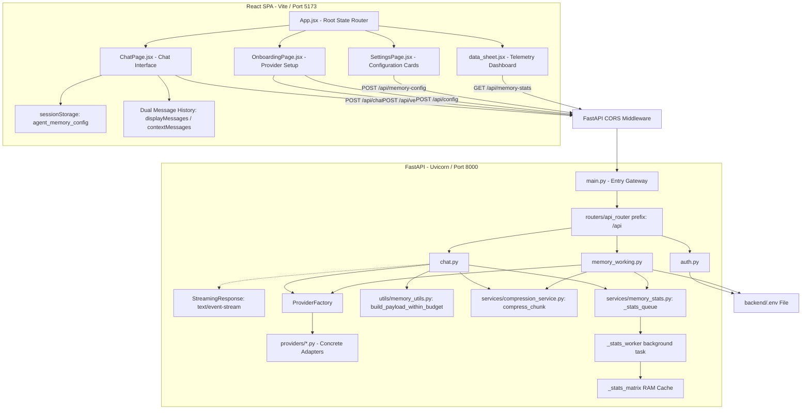

# System Architecture and Engineering Specification
**Project:** Agent Engine (`agent-v1`)  
**Auditor:** Principal Software Architect & Lead Technical Writer  
**Status:** Approved for Production Onboarding  

This document provides a definitive, production-ready architectural audit and technical specification of the entire `agent-v1` codebase. It details the high-level design, API endpoints, file structures, and critical data-processing pipelines.

---

## 1. High-Level System Architecture

The `agent-v1` ecosystem is structured as a decoupled, client-heavy single-page application (SPA) backed by an asynchronous, stateless service layer. The primary design patterns used are the **Adapter Pattern** (for multi-provider LLM integrations), the **Producer-Consumer Pattern** (for zero-friction telemetry ingestion), and the **Dual-History Windowing Pattern** (for local UI preservation vs. rolling context compression).



### End-to-End Communication Lifecycle

The standard client-server request-response lifecycle consists of the following steps:

1. **Initialization (Startup Check):**
   Upon mounting, the React root (`App.jsx`) executes an asynchronous fetch to `/api/config`.
   - If configured (`isConfigured: true`), the app state transitions to `chat` and hydrates state using the returned parameters.
   - If unconfigured, the user is redirected to `onboarding`.

2. **User Chat Execution:**
   - The user inputs a message in `ComposerInput.jsx`, appending it to the active session's `displayMessages` and `contextMessages`.
   - `ChatPage.jsx` calculates if the length of `contextMessages` exceeds the memory trigger threshold ($T$).
   - If exceeded, it extracts the oldest $T - R$ messages (where $R$ is the raw buffer size) as a `compressionChunk`, and marks `should_compress: true`.
   - The frontend issues a `POST` request to `/api/chat` carrying the active `contextMessages` (truncated to the latest $R$ messages to save tokens if compression is triggered) and the `compression_chunk`.

3. **Backend Request Ingestion & Parsing:**
   - The request hits the Uvicorn web server, which routes it through the CORS middleware, checking allowed origins.
   - FastAPI parses the incoming JSON payload against the Pydantic `ChatRequest` schema.
   - Fallback credentials are resolved from the server's `.env` file if not supplied in the request headers/body.

4. **Concurrent Streaming & Compression:**
   - The backend instantiates provider adapters via the `ProviderFactory`.
   - **Stream Pathway (Main Task):** The main chat LLM receives the messages. An asynchronous generator streams token chunks back to the client using Server-Sent Events (`text/event-stream`).
   - **Compression Pathway (Background Task):** Concurrently, if `should_compress` is `true`, an `asyncio.create_task` is spawned to process the `compression_chunk` using the memory model. The memory model merges the chunk into the `rolling_summary`.
   - If the epoch is a multiple of the grounding interval (default: every 5th epoch), a `grounding_pass` is triggered to eliminate semantic drift.

5. **SSE Stream Frame Assembly:**
   Frames are written to the connection socket using the `data: {...}\n\n` format:
   - Chunk frames: `{"chunk": "..."}`
   - Control frames (sent at the end of streaming if compression finished): `{"control": "memory_compact", "rolling_summary": "...", "truncated_count": N, "compression_epoch": N}`
   - Completion marker: `[DONE]`

6. **Frontend State Updates:**
   - The frontend's stream reader decodes incoming bytes.
   - Chunk text is appended to the UI.
   - Upon receiving `control: memory_compact`, the frontend slices the first $N$ messages from `contextMessages` to trim the LLM context, but leaves `displayMessages` untouched.

---

### State Boundaries and Persistence

The state of the application is partitioned across multiple layers:

| State Layer | Location | Mutability | Lifetime | Description |
| :--- | :--- | :--- | :--- | :--- |
| **System Environment** | `backend/.env` | Read/write (via `/api/config` and `/api/memory-config`) | Persistent (Disk) | Contains provider names, API keys, models, and memory configuration flags. |
| **Client Session Config** | Browser `sessionStorage` | Read/write (via SettingsPage UI) | Session | Key: `agent_memory_config`. Stores preset configurations (`precise`, `balanced`, `turbo`, or `custom`). |
| **UI Rendering State** | React components (`useState`) | Read/write (Local React state) | Ephemeral | Manages UI state, including sidebar toggle, renaming states, error messages, and streaming status. |
| **Session Message Ledger** | React `sessions` state | Read/write (via chat stream handlers) | Memory | Holds the dual lists `displayMessages` (full history) and `contextMessages` (trimmed history) per session. |
| **Telemetry Stats Cache** | `backend/services/memory_stats.py` (`_stats_matrix`) | Read/write (via worker queue) | Runtime | In-memory RAM cache of telemetry counters and arrays. Cleared upon backend process restart. |
| **Telemetry Buffer** | `backend/services/memory_stats.py` (`_stats_queue`) | Write-only (push), Read-only (pop) | Ephemeral | In-memory asyncio queue serving as the non-blocking buffer between routers and the stats worker. |

---

## 2. Exhaustive API & Endpoint Registry

### [1] GET /api/config
* **Backend Source:** [backend/routers/auth.py](file:///c:/Users/kumar/Documents/agent-v1/backend/routers/auth.py#L74)
* **Frontend Consumer:** [frontend/src/App.jsx:L108](file:///c:/Users/kumar/Documents/agent-v1/frontend/src/App.jsx#L108) (Startup Check), [LLMConfigCard.jsx:L13](file:///c:/Users/kumar/Documents/agent-v1/frontend/src/components/settings/LLMConfigCard.jsx#L13), [MemorySettingsCard.jsx:L21](file:///c:/Users/kumar/Documents/agent-v1/frontend/src/components/settings/MemorySettingsCard.jsx#L21)

#### Payload Interface / Schema
* **Headers:** `Accept: application/json`
* **Query Parameters:** None
* **Request Body:** None

#### Response Payload Contract
##### Success Response (HTTP 200)
```json
{
  "success": true,
  "isConfigured": true,
  "provider": "openai",
  "model": "gpt-4o",
  "hasApiKey": true,
  "memory_enabled": true,
  "use_separate_memory_provider": false,
  "memory_provider": "",
  "memory_model": "",
  "has_memory_api_key": false
}
```
##### Error Response (HTTP 500)
```json
{
  "detail": "Failed to read configuration parameters."
}
```

#### Architectural Mechanics & Internal Processing
1. Reads environment variables from the `backend/.env` file.
2. Checks if `LLM_PROVIDER`, `LLM_API_KEY`, and `LLM_MODEL_NAME` are defined and not empty.
3. Sets `isConfigured` to `true` if all three required fields are present.
4. Returns the configuration metadata, casting boolean environment variables from strings (`"true"`/`"false"`) to true booleans.

---

### [2] POST /api/config
* **Backend Source:** [backend/routers/auth.py](file:///c:/Users/kumar/Documents/agent-v1/backend/routers/auth.py#L136)
* **Frontend Consumer:** [frontend/src/pages/OnboardingPage.jsx:L354](file:///c:/Users/kumar/Documents/agent-v1/frontend/src/pages/OnboardingPage.jsx#L354), [LLMConfigCard.jsx:L97](file:///c:/Users/kumar/Documents/agent-v1/frontend/src/components/settings/LLMConfigCard.jsx#L97)

#### Payload Interface / Schema
* **Headers:** `Content-Type: application/json`
* **Request Body:**
```json
{
  "provider": "openai",
  "model_name": "gpt-4o",
  "api_key": "sk-proj-..." 
}
```

#### Response Payload Contract
##### Success Response (HTTP 200)
```json
{
  "success": true,
  "message": "Credentials saved."
}
```
##### Error Response (HTTP 400 / 500)
```json
{
  "success": false,
  "message": "Failed to save credentials: [error details]"
}
```

#### Architectural Mechanics & Internal Processing
1. Validates that `provider` and `model_name` are present.
2. Opens the local `backend/.env` file and reads its lines.
3. Updates matching keys (`LLM_PROVIDER`, `LLM_MODEL_NAME`, and optionally `LLM_API_KEY`) while preserving comments and other settings.
4. Overwrites the `.env` file with the updated configuration.

---

### [3] POST /api/verify-provider
* **Backend Source:** [backend/routers/auth.py](file:///c:/Users/kumar/Documents/agent-v1/backend/routers/auth.py#L97)
* **Frontend Consumer:** [OnboardingPage.jsx:L232](file:///c:/Users/kumar/Documents/agent-v1/frontend/src/pages/OnboardingPage.jsx#L232), [LLMConfigCard.jsx:L45](file:///c:/Users/kumar/Documents/agent-v1/frontend/src/components/settings/LLMConfigCard.jsx#L45), [MemorySettingsCard.jsx:L104](file:///c:/Users/kumar/Documents/agent-v1/frontend/src/components/settings/MemorySettingsCard.jsx#L104)

#### Payload Interface / Schema
* **Headers:** `Content-Type: application/json`
* **Request Body:**
```json
{
  "provider": "openai",
  "api_key": "sk-proj-...",
  "model_name": "gpt-4o"
}
```

#### Response Payload Contract
##### Success Response (HTTP 200)
```json
{
  "success": true,
  "message": "Connection verified."
}
```
##### Error Response (HTTP 200 with success: false)
```json
{
  "success": false,
  "message": "API key validation failed: Unauthorized."
}
```

#### Architectural Mechanics & Internal Processing
1. Extracts credentials from the request body. If the API key is not provided, it falls back to the key saved in `.env`.
2. Normalizes `google-gemini` to `gemini` for compatibility with the provider registry.
3. Instantiates the provider adapter via `ProviderFactory.create`.
4. Executes a validation check by sending a test message: `[{"role": "user", "content": "Ping"}]` with `max_tokens=5` to verify API accessibility.
5. If the call succeeds, it returns `success: true`. If an exception is caught, it captures the error message and returns `success: false`.

---

### [4] POST /api/chat
* **Backend Source:** [backend/routers/chat.py](file:///c:/Users/kumar/Documents/agent-v1/backend/routers/chat.py#L247)
* **Frontend Consumer:** [frontend/src/pages/ChatPage.jsx:L961](file:///c:/Users/kumar/Documents/agent-v1/frontend/src/pages/ChatPage.jsx#L961)

#### Payload Interface / Schema
* **Headers:** `Content-Type: application/json`
* **Request Body:**
```json
{
  "provider": "openai",
  "api_key": "sk-proj-...",
  "model_name": "gpt-4o",
  "session_id": "session_171828...",
  "use_memory": true,
  "memory_provider": "gemini",
  "memory_model": "gemini-1.5-flash",
  "memory_api_key": "AIzaSy...",
  "rolling_summary": "Prior conversation context summary...",
  "compression_epoch": 1,
  "summary_history": ["Old summary 1", "Old summary 2"],
  "should_compress": true,
  "compression_chunk": [
    { "role": "user", "content": "Hello" },
    { "role": "assistant", "content": "Hi there" }
  ],
  "messages": [
    { "role": "user", "content": "What is my project name?" }
  ],
  "memory_preset": "balanced",
  "memory_trigger_threshold": 30,
  "memory_raw_buffer": 10,
  "memory_summary_cap_tokens": 800,
  "memory_grounding_interval": 5
}
```

#### Response Payload Contract
* **Format:** `text/event-stream` (SSE)
* **Standard Chunks:** `data: {"chunk": "text segment"}\n\n`
* **Memory Compact Control Frame:** `data: {"control": "memory_compact", "rolling_summary": "...", "truncated_count": 2, "compression_epoch": 2}\n\n`
* **Completion Frame:** `data: [DONE]\n\n`
* **Error Frame:** `data: {"error": "Failed to connect to LLM provider."}\n\n`

#### Architectural Mechanics & Internal Processing
1. Increments the active session counter using `dispatch_stats_event("session_increment", {})`.
2. Resolves API key fallbacks and maps `google-gemini` to the `gemini` adapter key.
3. Invokes `cap_summary_by_tokens` to ensure the summary does not exceed the token budget.
4. Prepends the rolling summary to the conversation context.
5. Asynchronously executes `build_payload_within_budget` to prune historical messages if the total token count exceeds the limits.
6. Instantiates the main model provider and launches the streaming generator loop.
7. Concurrently, if `use_memory`, `should_compress`, and `compression_chunk` are active, it spawns `compress_chunk` as a background `asyncio.create_task`.
8. Streams response text chunks to the client and tracks performance metrics (latency, input/output tokens).
9. Upon stream completion, it records chat metrics using `dispatch_stats_event("chat_message", ...)`.
10. Awaits the compression background task (if spawned). If compression completed and the epoch matches the grounding interval, it executes a `grounding_pass` to reconcile the summary history.
11. Dispatches compression metrics via `dispatch_stats_event("compression", ...)` and yields the `memory_compact` control frame to the client.
12. Decrements the active session counter in the `finally` block using `dispatch_stats_event("session_decrement", {})`.

---

### [5] POST /api/memory-config
* **Backend Source:** [backend/routers/memory_working.py](file:///c:/Users/kumar/Documents/agent-v1/backend/routers/memory_working.py#L170)
* **Frontend Consumer:** [MemorySettingsCard.jsx:L164](file:///c:/Users/kumar/Documents/agent-v1/frontend/src/components/settings/MemorySettingsCard.jsx#L164)

#### Payload Interface / Schema
* **Headers:** `Content-Type: application/json`
* **Request Body:**
```json
{
  "memory_enabled": true,
  "use_separate_provider": true,
  "provider": "gemini",
  "model_name": "gemini-1.5-flash",
  "api_key": "AIzaSy..."
}
```

#### Response Payload Contract
##### Success Response (HTTP 200)
```json
{
  "success": true,
  "message": "Memory config saved successfully."
}
```
##### Error Response (HTTP 400)
```json
{
  "detail": "Memory provider, API key, and model name are required when using a separate provider."
}
```

#### Architectural Mechanics & Internal Processing
1. Validates that `provider` and `model_name` are set if `use_separate_provider` is true.
2. Formats the parameters into string values: `MEMORY_ENABLED`, `USE_SEPARATE_MEMORY_PROVIDER`, `MEMORY_PROVIDER`, `MEMORY_MODEL`, and `MEMORY_API_KEY`.
3. Opens the `backend/.env` file and updates or appends these values.

---

### [6] GET /api/memory-stats
* **Backend Source:** [backend/routers/memory_working.py](file:///c:/Users/kumar/Documents/agent-v1/backend/routers/memory_working.py#L200)
* **Frontend Consumer:** [data_sheet.jsx:L21](file:///c:/Users/kumar/Documents/agent-v1/frontend/src/pages/data_sheet.jsx#L21), [MemorySettingsCard.jsx:L130](file:///c:/Users/kumar/Documents/agent-v1/frontend/src/components/settings/MemorySettingsCard.jsx#L130)

#### Payload Interface / Schema
* **Headers:** None
* **Request Body:** None

#### Response Payload Contract
##### Telemetry Enabled Response (HTTP 200)
```json
{
  "telemetry_enabled": true,
  "active_sessions": 1,
  "total_messages": 14,
  "total_compressions": 2,
  "estimated_tokens_saved": 850,
  "current_epoch": 2,
  "timeline": {
    "timestamps": [171828100.25],
    "message_latencies_ms": [850.5],
    "prompt_tokens": [140],
    "completion_tokens": [45],
    "compression_ratios": [0.24],
    "grounding_epoch_markers": []
  }
}
```
##### Telemetry Disabled Response (HTTP 200)
```json
{
  "telemetry_enabled": false,
  "message": "Telemetry is turned off."
}
```

#### Architectural Mechanics & Internal Processing
1. Checks the global state variable `IS_TELEMETRY_ON` from `memory_stats.py`.
2. Returns a status message if telemetry is disabled.
3. If enabled, returns a copy of the in-memory `_stats_matrix` struct containing session counters, token metrics, and latency history.

---

### [7] POST /api/memory-stats/toggle
* **Backend Source:** [backend/routers/memory_working.py](file:///c:/Users/kumar/Documents/agent-v1/backend/routers/memory_working.py#L209)
* **Frontend Consumer:** [data_sheet.jsx:L37](file:///c:/Users/kumar/Documents/agent-v1/frontend/src/pages/data_sheet.jsx#L37), [MemorySettingsCard.jsx:L121](file:///c:/Users/kumar/Documents/agent-v1/frontend/src/components/settings/MemorySettingsCard.jsx#L121)

#### Payload Interface / Schema
* **Headers:** `Content-Type: application/json`
* **Request Body:**
```json
{
  "telemetry_enabled": true
}
```

#### Response Payload Contract
##### Success Response (HTTP 200)
```json
{
  "success": true,
  "telemetry_enabled": true
}
```

#### Architectural Mechanics & Internal Processing
1. Invokes `set_telemetry_state` in the statistics service.
2. Updates the global status flag `IS_TELEMETRY_ON`.
3. Spawns the background statistics processing task `_stats_worker` if toggled to `true`.
4. Cancels the background task if toggled to `false`.

---

### [8] POST /api/compress
* **Backend Source:** [backend/routers/memory_working.py](file:///c:/Users/kumar/Documents/agent-v1/backend/routers/memory_working.py#L239)
* **Frontend Consumer:** None (Standalone utility/test endpoint)

#### Payload Interface / Schema
* **Headers:** `Content-Type: application/json`
* **Request Body:**
```json
{
  "messages": [
    { "role": "user", "content": "I like dark mode." },
    { "role": "assistant", "content": "Setting updated." }
  ],
  "rolling_summary": "Existing user settings details...",
  "summary_history": [],
  "compression_epoch": 0,
  "raw_buffer": 1,
  "memory_provider": "openai",
  "memory_model": "gpt-4o",
  "memory_api_key": "sk-proj-..."
}
```

#### Response Payload Contract
##### Success Response (HTTP 200)
```json
{
  "new_summary": "User prefers dark mode layouts.",
  "truncated_count": 1,
  "grounding_applied": false
}
```
##### Error Response (HTTP 400 / 500)
```json
{
  "detail": "Compression process failed: API key invalid."
}
```

#### Architectural Mechanics & Internal Processing
1. Extracts the compression target chunk from `messages` using `get_chunk_for_compression(messages, R=raw_buffer)`.
2. Resolves fallback parameters for the memory provider from `.env` if not specified in the request.
3. Instantiates the model adapter.
4. Executes `compress_chunk` to process the target messages.
5. Runs a `grounding_pass` if the target epoch is a multiple of 5.
6. Calculates token statistics and dispatches metrics via `dispatch_stats_event("compression", ...)`.
7. Returns the updated summary text.

---

## 3. File-by-File Architectural Matrix

### Backend Files

#### `backend/main.py`
* **Architectural Role:** Application gateway and router initialization.
* **Component/Logic Breakdown:**
  * Instantiates the FastAPI application.
  * Registers CORS middleware to allow requests from local development origins (`localhost:5173`, `localhost:3000`).
  * Registers the prefix router (`/api`).
  * Configures Uvicorn server parameters (`host: 127.0.0.1`, `port: 8000`, `reload: True`).
* **Dependency & Relationship Mapping:**
  * **Imports:** `uvicorn`, `FastAPI`, `CORSMiddleware`, [backend/routers/\_\_init\_\_.py](file:///c:/Users/kumar/Documents/agent-v1/backend/routers/__init__.py).
  * **Imported by:** None.

#### `backend/routers/__init__.py`
* **Architectural Role:** Combines sub-routers into a unified API router structure.
* **Component/Logic Breakdown:**
  * Creates the unified `api_router` under the `/api` prefix.
  * Mounts routers from `auth.py`, `chat.py`, and `memory_working.py`.
* **Dependency & Relationship Mapping:**
  * **Imports:** `APIRouter` from `fastapi`, [backend/routers/auth.py](file:///c:/Users/kumar/Documents/agent-v1/backend/routers/auth.py), [backend/routers/chat.py](file:///c:/Users/kumar/Documents/agent-v1/backend/routers/chat.py), [backend/routers/memory_working.py](file:///c:/Users/kumar/Documents/agent-v1/backend/routers/memory_working.py).
  * **Imported by:** [backend/main.py](file:///c:/Users/kumar/Documents/agent-v1/backend/main.py).

#### `backend/routers/auth.py`
* **Architectural Role:** Manages environment configurations and tests connection paths.
* **Component/Logic Breakdown:**
  * `get_env_path()`: Returns the absolute path to the backend `.env` file.
  * `get_saved_config()`: Reads and returns provider, model, and memory configurations from `.env`.
  * `set_saved_config()`: Writes updated configuration parameters back to the `.env` file.
  * `get_config()`: API endpoint returning current settings status.
  * `verify_provider()`: API endpoint verifying credentials by sending a test message.
  * `save_config()`: API endpoint saving configuration parameters.
* **Dependency & Relationship Mapping:**
  * **Imports:** `os`, `APIRouter`, `HTTPException`, `BaseModel`, `dotenv_values`, [backend/providers/provider_factory.py](file:///c:/Users/kumar/Documents/agent-v1/backend/providers/provider_factory.py).
  * **Imported by:** [backend/routers/\_\_init\_\_.py](file:///c:/Users/kumar/Documents/agent-v1/backend/routers/__init__.py), [backend/routers/chat.py](file:///c:/Users/kumar/Documents/agent-v1/backend/routers/chat.py), [backend/routers/memory_working.py](file:///c:/Users/kumar/Documents/agent-v1/backend/routers/memory_working.py).

#### `backend/routers/chat.py`
* **Architectural Role:** Orchestrates real-time chat streaming, token budgeting, and background compression tasks.
* **Component/Logic Breakdown:**
  * Defines the Pydantic input validation structures `Message` and `ChatRequest`.
  * `stream_chat_response()`: Generates the SSE stream. Handles rolling summaries, token budgeting, chat metrics calculation, and context compression logic.
  * `chat()`: Endpoint handler returning the streaming generator.
* **Dependency & Relationship Mapping:**
  * **Imports:** `json`, `asyncio`, `time`, `StreamingResponse`, `BaseModel`, [backend/providers/provider_factory.py](file:///c:/Users/kumar/Documents/agent-v1/backend/providers/provider_factory.py), [backend/utils/memory_utils.py](file:///c:/Users/kumar/Documents/agent-v1/backend/utils/memory_utils.py), [backend/services/compression_service.py](file:///c:/Users/kumar/Documents/agent-v1/backend/services/compression_service.py), [backend/services/memory_stats.py](file:///c:/Users/kumar/Documents/agent-v1/backend/services/memory_stats.py).
  * **Imported by:** [backend/routers/\_\_init\_\_.py](file:///c:/Users/kumar/Documents/agent-v1/backend/routers/__init__.py).

#### `backend/routers/memory_working.py`
* **Architectural Role:** Exposes memory configuration, compression utilities, and telemetry toggle endpoints.
* **Component/Logic Breakdown:**
  * Defines Pydantic validation structures (`MemoryConfigRequest`, `VerifyRequest`, `CompressRequest`, `ToggleTelemetryRequest`).
  * `save_memory_config()`: Endpoint saving memory configuration options.
  * `memory_stats()`: Endpoint returning a snapshot of telemetry data.
  * `toggle_telemetry()`: Endpoint toggling the statistics system state.
  * `compress_endpoint()`: Endpoint executing standalone text compression requests.
* **Dependency & Relationship Mapping:**
  * **Imports:** `APIRouter`, `HTTPException`, `BaseModel`, `asyncio`, [backend/providers/provider_factory.py](file:///c:/Users/kumar/Documents/agent-v1/backend/providers/provider_factory.py), [backend/services/compression_service.py](file:///c:/Users/kumar/Documents/agent-v1/backend/services/compression_service.py), [backend/utils/memory_utils.py](file:///c:/Users/kumar/Documents/agent-v1/backend/utils/memory_utils.py), [backend/services/memory_stats.py](file:///c:/Users/kumar/Documents/agent-v1/backend/services/memory_stats.py).
  * **Imported by:** [backend/routers/\_\_init\_\_.py](file:///c:/Users/kumar/Documents/agent-v1/backend/routers/__init__.py).

#### `backend/services/compression_service.py`
* **Architectural Role:** Coordinates content summarization and drift reconciliation.
* **Component/Logic Breakdown:**
  * Defines prompts: `ANCHORED_COMPRESSION_PROMPT` (preserves prior facts while appending new data) and `GROUNDING_PROMPT` (reconciles summary versions to eliminate drift).
  * `compress_chunk()`: Combines new message history into the rolling summary ledger. Caps summary output length using token-aware splits.
  * `grounding_pass()`: Invokes the model provider to reconcile multiple summary versions.
* **Dependency & Relationship Mapping:**
  * **Imports:** `asyncio`, `json`, [backend/utils/memory_utils.py](file:///c:/Users/kumar/Documents/agent-v1/backend/utils/memory_utils.py).
  * **Imported by:** [backend/routers/chat.py](file:///c:/Users/kumar/Documents/agent-v1/backend/routers/chat.py), [backend/routers/memory_working.py](file:///c:/Users/kumar/Documents/agent-v1/backend/routers/memory_working.py).

#### `backend/services/memory_stats.py`
* **Architectural Role:** Asynchronous in-memory telemetry ingestion and processing.
* **Component/Logic Breakdown:**
  * `IS_TELEMETRY_ON`: Global master flag.
  * `_stats_matrix`: In-memory cache structure storing session counts, message rates, and performance timelines.
  * `set_telemetry_state()`: Toggles statistics collection and handles startup/shutdown of the background statistics worker.
  * `dispatch_stats_event()`: Non-blocking function for pushing event payloads to the asyncio queue.
  * `_stats_worker()`: Background worker consuming event frames from the queue and updating statistics.
  * `get_all_stats()`: Returns a snapshot of telemetry data.
* **Dependency & Relationship Mapping:**
  * **Imports:** `asyncio`, `time`.
  * **Imported by:** [backend/routers/chat.py](file:///c:/Users/kumar/Documents/agent-v1/backend/routers/chat.py), [backend/routers/memory_working.py](file:///c:/Users/kumar/Documents/agent-v1/backend/routers/memory_working.py).

#### `backend/utils/memory_utils.py`
* **Architectural Role:** Context window calculations and token limit verification.
* **Component/Logic Breakdown:**
  * `get_encoder()`: Loads the `tiktoken` encoder (falls back to `cl100k_base` if offline).
  * `count_tokens()`: Calculates token counts.
  * `is_oversized_message()`: Evaluates if a single message exceeds a specified ratio of the total budget.
  * `_sync_build_payload_within_budget()`: Processes the message array from freshest to oldest to build a payload that fits the token budget.
  * `build_payload_within_budget()`: Asynchronous wrapper offloading token calculations to a worker thread using `asyncio.to_thread`.
  * `should_compress()`: Checks if message history length exceeds the trigger threshold.
  * `get_chunk_for_compression()`: Splits messages into a compression chunk and a rolling window buffer.
  * `cap_summary_by_tokens()`: Truncates summary strings to fit within token limits.
* **Dependency & Relationship Mapping:**
  * **Imports:** `asyncio`, `tiktoken`.
  * **Imported by:** [backend/routers/chat.py](file:///c:/Users/kumar/Documents/agent-v1/backend/routers/chat.py), [backend/routers/memory_working.py](file:///c:/Users/kumar/Documents/agent-v1/backend/routers/memory_working.py), [backend/services/compression_service.py](file:///c:/Users/kumar/Documents/agent-v1/backend/services/compression_service.py).

#### `backend/providers/base_provider.py`
* **Architectural Role:** Abstract base class defining the provider interface.
* **Component/Logic Breakdown:**
  * Defines the standard async methods `generate_response()` and `generate_stream()`.
* **Dependency & Relationship Mapping:**
  * **Imports:** `abc` (`ABC`, `abstractmethod`), `typing`.
  * **Imported by:** [backend/providers/provider_factory.py](file:///c:/Users/kumar/Documents/agent-v1/backend/providers/provider_factory.py), all concrete provider files.

#### `backend/providers/provider_factory.py`
* **Architectural Role:** Registry and factory for instantiating model adapters.
* **Component/Logic Breakdown:**
  * `_registry`: Mapping of provider strings to concrete adapter classes.
  * `create()`: Validates inputs, resolves mappings, and returns the initialized provider instance.
* **Dependency & Relationship Mapping:**
  * **Imports:** `fastapi` (`HTTPException`), concrete provider implementations.
  * **Imported by:** [backend/routers/auth.py](file:///c:/Users/kumar/Documents/agent-v1/backend/routers/auth.py), [backend/routers/chat.py](file:///c:/Users/kumar/Documents/agent-v1/backend/routers/chat.py), [backend/routers/memory_working.py](file:///c:/Users/kumar/Documents/agent-v1/backend/routers/memory_working.py).

#### Concrete Provider Adapters (`backend/providers/*.py`)
* **Architectural Role:** Concrete wrappers implementing the BaseProvider interface.
* **Details:**
  * The codebase contains 15 provider wrappers: `openai`, `anthropic`, `gemini`, `mistral`, `groq`, `cohere`, `deepseek`, `openrouter`, `togetherai`, `ai21`, `cerebras`, `deepinfra`, `fireworksai`, `huggingface`, and `nvidianim`.
  * OpenAI-compatible providers (`deepinfra`, `nvidianim`, `openrouter`, `togetherai`, `deepseek`, `fireworksai`) wrap `AsyncOpenAI` with custom `base_url` values.

---

### Frontend Files

#### `frontend/src/App.jsx`
* **Architectural Role:** Root component managing application state transitions and network status.
* **Component/Logic Breakdown:**
  * `appState`: State router tracking transitions between `splash`, `onboarding`, `chat`, and `telemetry`.
  * `runStartupCheck()`: Fetches `/api/config` to check settings status and redirects the user accordingly.
  * Monitors `online` and `offline` browser events, triggering a network notification banner when connection drops.
* **Dependency & Relationship Mapping:**
  * **Imports:** `react`, components (`NetworkBanner`, `SplashScreen`), pages (`OnboardingPage`, `ChatPage`, `TelemetryDashboard`).
  * **Imported by:** [frontend/src/main.jsx](file:///c:/Users/kumar/Documents/agent-v1/frontend/src/main.jsx).

#### `frontend/src/pages/ChatPage.jsx`
* **Architectural Role:** Main user interface managing session lifecycle and streaming connections.
* **Component/Logic Breakdown:**
  * `sessions`: State array tracking the history of all active chat sessions.
  * `activeSessionId`: Identifies the session currently rendered in the viewport.
  * `getActiveMemoryConfig()`: Reads context presets (`precise`, `balanced`, `turbo`) from `sessionStorage`.
  * `sendMessage()`: Handles sending messages to the chat endpoint and processes incoming server-sent event (SSE) streams.
  * Handles the `memory_compact` control frame, updating local context array slices accordingly.
* **Dependency & Relationship Mapping:**
  * **Imports:** react state hooks, child UI panels (`ComposerInput`, `ConnectionToast`, `MemoryCompressionBadge`, `MessageFormatter`, `Configuration`, `SettingsNav`).
  * **Imported by:** [frontend/src/App.jsx](file:///c:/Users/kumar/Documents/agent-v1/frontend/src/App.jsx).

#### `frontend/src/pages/OnboardingPage.jsx`
* **Architectural Role:** Initial setup interface for configuring provider details.
* **Component/Logic Breakdown:**
  * Captures user input for API keys, model selections, and provider keys.
  * Verifies settings by calling `POST /api/verify-provider`.
  * Saves configurations to the environment by calling `POST /api/config`.
* **Dependency & Relationship Mapping:**
  * **Imports:** React, `axios`, [frontend/src/components/Spinner.jsx](file:///c:/Users/kumar/Documents/agent-v1/frontend/src/components/Spinner.jsx), [frontend/src/components/ProviderField.jsx](file:///c:/Users/kumar/Documents/agent-v1/frontend/src/components/ProviderField.jsx).
  * **Imported by:** [frontend/src/App.jsx](file:///c:/Users/kumar/Documents/agent-v1/frontend/src/App.jsx).

#### `frontend/src/pages/data_sheet.jsx`
* **Architectural Role:** Dashboard rendering live statistics and telemetry charts.
* **Component/Logic Breakdown:**
  * Renders the `TelemetryDashboard` interface.
  * Periodically polls `/api/memory-stats` every 3 seconds to fetch performance metrics.
  * `handleToggleTelemetry()`: Calls `/api/memory-stats/toggle` to enable or disable statistics tracking.
* **Dependency & Relationship Mapping:**
  * **Imports:** charts (`CompressionEfficiencyChart`, `LatencyWaveChart`, `MetricCards`, `TokenDistributionChart`).
  * **Imported by:** [frontend/src/App.jsx](file:///c:/Users/kumar/Documents/agent-v1/frontend/src/App.jsx).

#### `frontend/src/components/settings/LLMConfigCard.jsx`
* **Architectural Role:** Settings interface for updating core provider details.
* **Component/Logic Breakdown:**
  * Reads the active provider configuration.
  * Provides inputs for updating API keys, model selections, and provider configurations.
  * Verifies connection settings before calling the save API.
* **Dependency & Relationship Mapping:**
  * **Imports:** React hooks, `Spinner`.
  * **Imported by:** [frontend/src/components/settings/Configuration.jsx](file:///c:/Users/kumar/Documents/agent-v1/frontend/src/components/settings/Configuration.jsx).

#### `frontend/src/components/settings/MemorySettingsCard.jsx`
* **Architectural Role:** Settings interface for configuring context compression and memory settings.
* **Component/Logic Breakdown:**
  * Fetches the current memory settings from `/api/config`.
  * Configures independent providers for context compression.
  * Exposes options to toggle telemetry and select compression presets (`precise`, `balanced`, `turbo`).
* **Dependency & Relationship Mapping:**
  * **Imports:** React hooks, standard configuration UI fields.
  * **Imported by:** [frontend/src/components/settings/Configuration.jsx](file:///c:/Users/kumar/Documents/agent-v1/frontend/src/components/settings/Configuration.jsx).

---

## 4. Core Engine Data Flow & State Management Pipelines

### [1] Dual-Array Session Message Lifecycle

To prevent context window limits from dropping message history in the UI, the frontend manages two distinct message arrays per session.

```
Incoming User Message
      │
      ├──> Appended to displayMessages (Renders full history in UI)
      │
      └──> Appended to contextMessages (Sent to API for inference)
                │
                ├──> Length < Trigger Threshold (T) ? ──> Send full contextMessages
                │
                └──> Length >= Trigger Threshold (T) ?
                          │
                          ├──> Slice oldest (T - R) messages as compression_chunk
                          ├──> Slice latest (R) messages as messages payload
                          ├──> Send with should_compress: true
                          │
                          └──> SSE Stream processes response
                                    │
                                    └──> Control Frame: memory_compact received
                                              │
                                              └──> Prune contextMessages by N
                                                   (displayMessages remains untouched)
```

This dual-array strategy ensures that the user's view remains complete and uninterrupted, while the context window sent to the LLM stays within optimal token limits.

---

### [2] Real-Time Streaming and Compression Pipeline

When the user submits a message, streaming generation and context compression run concurrently to minimize response latency.

```
Client (ChatPage.jsx)          FastAPI Server (chat.py)          LLM / Memory Provider
       │                                   │                                │
       │ ─── POST /api/chat ─────────────> │                                │
       │     (should_compress: true)       │                                │
       │                                   │ ─── Generate Chat Stream ────> │
       │                                   │ <── Token chunks received ───  │
       │ <── Yield standard chunk ──────── │                                │
       │                                   │                                │
       │                                   │ ─── Spawn Background Task ───> │
       │                                   │     (compress_chunk)           │
       │                                   │                                │
       │                                   │ ─── Request Compression ─────> │
       │                                   │ <── Updated summary text ────  │
       │                                   │                                │
       │                                   │ ─── Grounding Pass (if epoch%5==0) ──> │
       │                                   │ <── Reconciled summary text ─  │
       │                                   │                                │
       │ <── Yield memory_compact frame ── │                                │
       │ <── Yield [DONE] ──────────────── │                                │
```

This concurrent pipeline processes text compression in parallel with streaming text delivery, ensuring that summarization does not block the user interface.

---

### [3] Token Budget and Message Trimming Pipeline

Before messages are passed to the model provider, the backend verifies that the payload stays within safety limits.

1. **System Prompt and Summary Lock:**
   The backend calculates the token footprints of the system prompt and the `rolling_summary` using the tiktoken wrapper:
   $$\text{Tokens Used} = \text{Count}(\text{System Prompt}) + \text{Count}(\text{Rolling Summary})$$
   These are treated as non-negotiable context. If the combined size exceeds the budget, a `ValueError` is raised, prompting a grounding pass.

2. **Oversized Message Handling:**
   Individual messages in the conversation history are checked. If a message consumes more than $30\%$ of the remaining budget:
   - The message text is truncated to the first 4000 characters.
   - An indicator `[truncated - oversized message condensed before model call]` is appended.

3. **Reversed Evaluation Loop:**
   The backend iterates through the conversation history from newest to oldest:
   $$\text{Tokens Used} \leftarrow \text{Tokens Used} + \text{Count}(\text{Message}) + 4$$
   If adding the next message exceeds the token limit, the loop terminates, and older messages are dropped.

4. **Minimum Window Constraint:**
   If the budget rules drop too many messages, a hard floor keeps the 5 most recent messages to maintain the context of the immediate conversation.

---

### [4] Telemetry Processing Pipeline

Statistics and telemetry events are processed asynchronously through a queue to prevent telemetry logging from introducing latency to the chat loop.

```
Router / App Operations
       │
       ├──> dispatch_stats_event(event_type, payload)
       │         │
       │         ├──> IS_TELEMETRY_ON == false ──> Exit instantly (0ms overhead)
       │         │
       │         └──> IS_TELEMETRY_ON == true ──> Non-blocking queue push
       │
       └──> Queue (_stats_queue)
                │
                └──> Asynchronous worker (_stats_worker)
                          │
                          ├──> Reads event frames sequentially
                          ├──> Updates _stats_matrix variables in RAM
                          └──> Truncates history arrays if size > MAX_HISTORY_LEN (500)
```

This design decouples analytics processing from API request handling, preventing telemetry collection from impacting user response times.

---

### [5] Onboarding and Startup Hydration Flow

When the client application starts up, it runs a configuration verification and hydration check:

```
            App Mounted
                 │
        GET /api/config call
                 │
        ┌────────┴────────┐
        ▼                 ▼
isConfigured == false  isConfigured == true
  │                       │
  │                       ├──> Hydrate verifiedProvider parameters:
  │                       │    - provider / modelName
  │                       │    - memoryEnabled / useSeparateMemoryProvider
  │                       │    - memoryProvider / memoryModel
  │                       │
  │                       └──> Transition appState to "chat"
  │
Onboarding redirect
  │
User enters credentials
  │
POST /api/verify-provider (connection test check)
  │
POST /api/config (save settings to .env file)
  │
Transition appState to "chat"
```

This startup sequence ensures that the frontend hydrates its configuration state from the backend environment, directing the user to onboarding only if credentials are missing.
